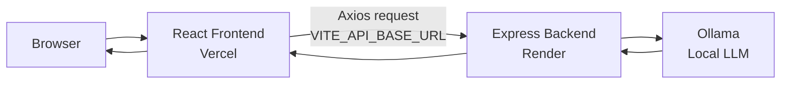
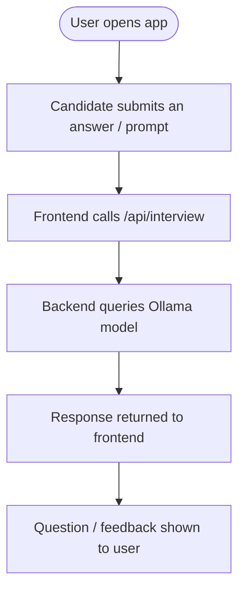

<div align="center">

# 🎤 AI Interview

### Practice mock interviews with AI-generated questions and feedback — running on your own local LLM.

[](#-project-status)
[](https://react.dev)
[](https://vitejs.dev)
[](https://tailwindcss.com)
[](https://expressjs.com)
[](https://ollama.com)
[](#-license)

[🚀 Live Demo](https://ai-interview-gilt-six.vercel.app) · [📦 Repository](https://github.com/vikasyadav098/Ai-Interview) · [🐞 Report Bug](https://github.com/vikasyadav098/Ai-Interview/issues) · [✨ Request Feature](https://github.com/vikasyadav098/Ai-Interview/issues)

</div>

---

## 🚧 Project Status

This project is in **early, active development**. This README intentionally documents only what's verifiably built today, plus a clearly-labeled roadmap for what's planned — nothing below is fabricated.

**Confirmed and working:**
- React frontend deployed on Vercel
- Node.js/Express backend deployed on Render, reachable at `/api/interview`
- Backend integrates with **Ollama** for locally-run LLM inference (no paid API key required)

**Not yet confirmed / likely still in progress:**
- Exact interview flow (resume upload vs. plain Q&A vs. voice) — TBD
- Authentication, dashboards, scoring history
- Full API contract (routes, request/response shapes)

If you're a contributor or recruiter reading this: treat the **Features** and **Roadmap** sections below as the source of truth for what's done vs. planned.

---

## 📖 Overview

**AI Interview** is a mock-interview practice tool. The idea: a candidate answers interview questions in the browser, the answer is sent to a backend service, which forwards it to a **locally-hosted LLM (via Ollama)** to generate follow-up questions and/or feedback — without depending on a paid third-party AI API.

**Why it exists:** most AI mock-interview tools require an OpenAI/Gemini API key and ongoing cost. Running the model through Ollama means the AI layer can run entirely on infrastructure the developer controls.

**Target users:** job seekers preparing for technical/behavioral interviews who want a free, self-hostable practice tool.

---

## 🔗 Live Demo

| Layer | URL | Notes |
|---|---|---|
| Frontend | [ai-interview-gilt-six.vercel.app](https://ai-interview-gilt-six.vercel.app) | Deployed via Vercel |
| Backend API | `ai-interview-backend-02ee.onrender.com` | Deployed via Render; root path returns 404 by design (API-only, no homepage) |

> ⚠️ Render free-tier services spin down when idle — the first request after inactivity may take 20–30s to respond.

---

## ✨ Features

| Feature | Status |
|---|---|
| 🤖 AI-generated interview questions (via Ollama) | ✅ Backend integration built |
| 💬 Candidate answer submission | ✅ Basic flow wired to `/api/interview` |
| 🧠 AI feedback on answers | 🔄 In progress |
| 📄 Resume-based question tailoring | 🗓️ Planned |
| 🎤 Voice input | 🗓️ Planned |
| 📊 Scoring / performance reports | 🗓️ Planned |
| 🔐 Authentication | 🗓️ Planned |
| 🌙 Dark mode | 🗓️ Planned |
| 📱 Responsive design | 🔄 Depends on Tailwind config — not yet verified across breakpoints |

---

## 🛠️ Tech Stack

<table>
<tr>
<td valign="top" width="50%">

**Frontend**
- React 19
- Vite 7
- Tailwind CSS 4
- React Router 7
- Axios (HTTP client)

</td>
<td valign="top" width="50%">

**Backend**
- Node.js
- Express
- Deployed on Render

</td>
</tr>
<tr>
<td valign="top">

**AI Layer**
- [Ollama](https://ollama.com) (local LLM inference — specific model not yet documented)

</td>
<td valign="top">

**Deployment**
- Frontend → Vercel
- Backend → Render

</td>
</tr>
</table>

> Database, authentication provider, and state-management library are not present in `package.json` as of this writing — none are claimed here.

---

## 🏗️ Architecture



---

## 🔄 User Flow (current, best-known)



> Resume upload and multi-round interview flow are **planned**, not yet confirmed as live.

---

## 📁 Folder Structure (frontend, confirmed)

```
Ai-Interview/
├── public/
│   └── vite.svg
├── src/
├── .env.example
├── index.html
├── package.json
├── tailwind.config.js
└── vite.config.js
```

> The backend lives in a separate service (not in this repository as far as documented here) — its folder structure isn't included to avoid guessing.

---

## ⚙️ Installation

### Frontend

```bash
# Clone the repository
git clone https://github.com/vikasyadav098/Ai-Interview.git
cd Ai-Interview

# Install dependencies
npm install

# Set up environment variables
cp .env.example .env

# Run the dev server
npm run dev

# Build for production
npm run build
```

### Backend

The backend is a separate Node.js/Express service that must be running (or reachable) for the frontend to function, with Ollama available for it to call. Exact setup steps (scripts, required env vars, Ollama model name) aren't documented in this repo yet — add them here once finalized.

---

## 🔑 Environment Variables

`.env.example` (frontend):

```env
VITE_API_BASE_URL=/api/interview
```

| Variable | Description |
|---|---|
| `VITE_API_BASE_URL` | Base path the frontend uses to call the interview API |

> Backend environment variables (e.g. Ollama host/model, `PORT`) aren't documented here yet since the backend repo/config wasn't shared.

---

## 📡 API Documentation

| Route | Method | Status |
|---|---|---|
| `/api/interview` | Unconfirmed | The only endpoint referenced in the frontend config so far |

Full request/response payloads aren't documented yet — recommended next step is generating this from the actual Express route handlers.

---

## 🗺️ Roadmap

- [ ] Document and finalize the `/api/interview` contract
- [ ] Resume upload + parsing
- [ ] Structured AI feedback (strengths / weaknesses / score)
- [ ] Voice-based Q&A
- [ ] Authentication & saved interview history
- [ ] Dashboard for reviewing past sessions
- [ ] Dark mode
- [ ] Deployment docs for self-hosting Ollama

---

## 🤝 Contributing

Contributions are welcome.

1. Fork the repository
2. Create a feature branch (`git checkout -b feature/your-feature`)
3. Commit your changes
4. Push to your fork and open a Pull Request

---

## 📄 License

Distributed under the MIT License. See `LICENSE` for details.

---

## 🐛 Support

Found a bug or have a question? [Open an issue](https://github.com/vikasyadav098/Ai-Interview/issues).

---

## ❓ FAQ

<details>
<summary><b>Do I need an OpenAI/Gemini API key to run this?</b></summary>
No — the AI layer runs through Ollama, so inference can happen locally without a paid API key.
</details>

<details>
<summary><b>Why does the backend URL return a 404?</b></summary>
The backend is an API-only Express service with no homepage route — it only responds on specific endpoints like <code>/api/interview</code>.
</details>

<details>
<summary><b>Is this project production-ready?</b></summary>
No — see the <a href="#-project-status">Project Status</a> section above. It's an early-stage, actively developed project.
</details>

---

## 👤 Author

**Vikas Yadav**
[GitHub](https://github.com/vikasyadav098)

---

<div align="center">

Made with ❤️ — if this project is useful to you, consider leaving a ⭐

</div>
